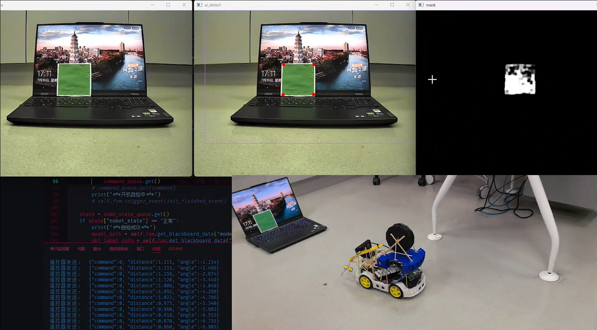

# Uni-X Mate
Uni-X Mate, Always a helpful Universal Personal Assistant

----

## What is Uni-X Mate or Uni-X Finder ? 
 - Uni-X Mate is a personal assistant
 - Working well on remember where your daily things are
 - It can help you to find your daily things
 - Also support some useful functions

## How it works ?
 - Use STT model to turn your voice to text
 - using NLP and LLM to extract the target obj and generate response
 - Using TTS model to turn the response to voice
 - Using YOLOv10 and PnPSolver to find the target obj
 - Using PostgreSQL to remember where is your daily things

## IMPORTANT TIPS:
 - DO NOT CLONE THIS REPO NOW!!!
 - ALL CODE IS DIRTY AND UNSAFE
 - WE STILL NEED TO FIX SOME ISSUES AND IMPROVE THE CODE
 - THIS REPO IS ONLY FOR DEMOSTRATION PURPOSE!!!

 ## Demo Video
